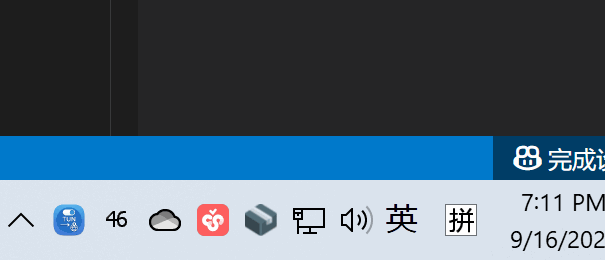

# TUNTray (中文)

这是一个为 [xjasonlyu/tun2socks](https://github.com/xjasonlyu/tun2socks) 项目开发的 Windows 系统托盘图形界面（GUI）。它旨在简化 `tun2socks` 的启动、停止以及代理服务器的切换操作。

**特别感谢 [Jason (`xjasonlyu`)](https://github.com/xjasonlyu) 开发了如此强大的核心工具。**

本项目本质上是一个方便用户操作的封装，核心功能由 `tun2socks` 提供。

## 功能

-   通过系统托盘图标启动和停止 TUN 流量转发。
-   在预设的代理服务器列表中进行选择。
-   通过图形界面添加和删除代理服务器。
-   程序启动时自动请求管理员权限。

## 演示 (Demo)



## 文件结构

```
.
├── build/                  # 编译输出目录
│   └── TUNTray/            # 分发包目录
│       ├── TUNTray.exe     # 编译后的主程序
│       ├── tun2socks.exe   # 核心的流量转发工具
│       └── wintun.dll      # Wintun 驱动的运行时库
├── main.go                 # 应用程序的 Go 源代码
├── go.mod / go.sum         # Go 模块文件
├── config.json             # 配置文件 (首次运行于 TUNTray 目录内生成)
├── tun2socks.exe           # 核心工具 (源码级)
├── wintun.dll              # Wintun 库 (源码级)
├── wintun/                 # 包含 x86 和 x64 版本的 wintun.dll
└── winres/                 # Windows 资源目录
    ├── winres.json         # go-winres 工具的配置文件
    ├── icon.png            # 应用程序图标
    └── icon16.png          # 小尺寸图标
```

## 配置

应用程序通过 `proxies.json` 文件管理代理列表。如果文件不存在，程序会创建一个包含默认代理的示例文件。

文件格式为一个 JSON 数组，其中包含代理服务器的地址字符串：

```json
[
  "http://192.168.5.101:7890",
  "socks5://127.0.0.1:1080"
]
```

## 构建说明

本项目使用 `go-winres` 工具将应用程序图标和一个重要的应用程序清单（Manifest）嵌入到最终的可执行文件中。该清单用于请求管理员权限并启用新版 Windows 控件样式。

**首次构建或需要更新资源时，请执行以下完整命令：**

1.  **安装/更新构建工具** (如果尚未安装):
    ```shell
    go install github.com/tc-hib/go-winres@latest
    ```

2.  **清理、编译并打包到 `build` 目录**:
    此命令会完成以下所有操作：
    - 创建 `build/TUNTray` 目录。
    - 生成 `.syso` 资源文件。
    - 编译 Go 代码并将可执行文件输出到 `build/TUNTray` 目录。
    - 将运行所需的 `tun2socks.exe` 和 `wintun.dll` 复制到 `build/TUNTray` 目录。

    **在 PowerShell 中运行:**
    ```powershell
    New-Item -ItemType Directory -Force -Path build/TUNTray; go-winres make; go build -ldflags="-H windowsgui" -o build/TUNTray/TUNTray.exe; Copy-Item tun2socks.exe, wintun.dll -Destination build/TUNTray/
    ```

**日常开发**：如果只是修改了 `.go` 文件，可以只运行编译步骤以提高速度：
```powershell
go build -ldflags="-H windowsgui" -o build/TUNTray/TUNTray.exe
```

## 运行要求

-   本程序需要**管理员权限**才能创建和配置 TUN 网络适配器。由于已嵌入清单，双击运行时 Windows 会自动弹出 UAC 提示请求授权。
-   确保 `tun2socks.exe` 和 `wintun.dll` 文件与 `TUNTray.exe` 在同一目录下。

## 分发

构建流程优化后，分发变得非常简单。您只需将 `build/TUNTray` 目录打包成一个 ZIP 文件即可。

用户解压后，在 `TUNTray` 文件夹内运行 `TUNTray.exe`。`config.json` 配置文件也将在首次运行时于 `TUNTray` 目录内自动创建。

---

# TUNTray (English)

This is a Windows system tray GUI application developed for the [xjasonlyu/tun2socks](https://github.com/xjasonlyu/tun2socks) project. It aims to simplify the process of starting, stopping, and switching proxy servers for `tun2socks`.

**Special thanks to [Jason (`xjasonlyu`)](https://github.com/xjasonlyu) for developing such a powerful core tool.**

This project is essentially a user-friendly wrapper, with the core functionality provided by `tun2socks`.

## Features

-   Start and stop TUN traffic forwarding via the system tray icon.
-   Select from a preset list of proxy servers.
-   Add and remove proxy servers through a graphical interface.
-   Automatically requests administrator privileges on startup.

## Demo


## File Structure

```
.
├── build/                  # Build output directory
│   └── TUNTray/            # Distribution package directory
│       ├── TUNTray.exe     # Compiled main program
│       ├── tun2socks.exe   # Core traffic forwarding tool
│       └── wintun.dll      # Wintun driver runtime library
├── main.go                 # Go source code for the application
├── go.mod / go.sum         # Go module files
├── config.json             # Configuration file (generated in the TUNTray directory on first run)
├── tun2socks.exe           # Core tool (source level)
├── wintun.dll              # Wintun library (source level)
├── wintun/                 # Contains x86 and x64 versions of wintun.dll
└── winres/                 # Windows resource directory
    ├── winres.json         # Configuration file for go-winres tool
    ├── icon.png            # Application icon
    └── icon16.png          # Small-sized icon
```

## Configuration

The application manages the proxy list through a `proxies.json` file. If the file does not exist, the program will create a sample file containing default proxies.

The file format is a JSON array of proxy server address strings:

```json
[
  "http://192.168.5.101:7890",
  "socks5://127.0.0.1:1080"
]
```

## Build Instructions

This project uses the `go-winres` tool to embed the application icon and an important application manifest into the final executable. This manifest is used to request administrator privileges and enable modern Windows control styles.

**For the first build or when resources need to be updated, execute the following full command:**

1.  **Install/Update Build Tools** (if not already installed):
    ```shell
    go install github.com/tc-hib/go-winres@latest
    ```

2.  **Clean, Compile, and Package into the `build` directory**:
    This command performs all the following actions:
    - Creates the `build/TUNTray` directory.
    - Generates the `.syso` resource file.
    - Compiles the Go code and outputs the executable to the `build/TUNTray` directory.
    - Copies the required `tun2socks.exe` and `wintun.dll` to the `build/TUNTray` directory.

    **Run in PowerShell:**
    ```powershell
    New-Item -ItemType Directory -Force -Path build/TUNTray; go-winres make; go build -ldflags="-H windowsgui" -o build/TUNTray/TUNTray.exe; Copy-Item tun2socks.exe, wintun.dll -Destination build/TUNTray/
    ```

**For daily development**: If you only modify `.go` files, you can run just the compilation step for faster builds:
```powershell
go build -ldflags="-H windowsgui" -o build/TUNTray/TUNTray.exe
```

## Running Requirements

-   This program requires **administrator privileges** to create and configure the TUN network adapter. Since the manifest is embedded, Windows will automatically show a UAC prompt to request authorization when you double-click to run it.
-   Ensure that `tun2socks.exe` and `wintun.dll` are in the same directory as `TUNTray.exe`.

## Distribution

Distribution is straightforward with the optimized build process. You just need to package the entire `build/TUNTray` directory into a ZIP file.

After users unzip the file, they can run `TUNTray.exe` directly from the `TUNTray` folder. The `config.json` file will also be created automatically in the `TUNTray` directory on the first run.
